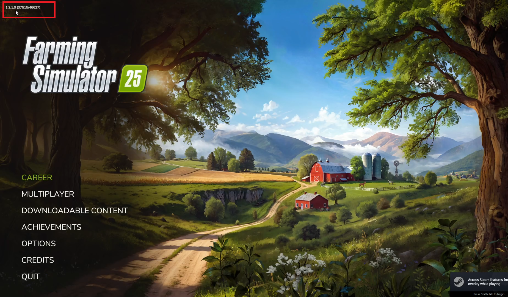

# FS25 1.3(after update) D3D_12 error fix

After a long wait, we finally got the first patch update for FS25. However, with this update came new problems...  

Some players using older GPUs now encounter a *D3D_12 support error* when launching the game.  
Others have had their game saves bricked.  

If you’re one of these people, read this guide—there’s a 100% chance you’ll find a fix here.  

### First Fix (Easier Option):  
1. Go to `Documents/mygames/Farming Simulator 25`.  
2. Open `game.xml` using Notepad.  
3. Find `D3D_12` and change it to `Vulkan`.  

**P.S.:** This fix will make the game work (for some players), but there are downsides:  
- The game might look worse.  
- The biggest issue: if you alt+tab, the game will instantly shut down.  

### Second Fix (Downgrade from 1.3 to Legacy Version — Use if it worked before the update):  
1. Make sure your auto-update is turned off in Steam. The files on Google Drive are 4GB because they contain the old version of the game files.
2. Download the downgrader from Google Drive and extract it. Here’s the link: [Downgrader Download](https://drive.google.com/file/d/1vwMeTYPD6aNXXUKclKGzkemwMl5ot92D/view?usp=drive_link).  
3. Copy `Downgrader.bat` to `Steam\steamapps\common`. Make sure it’s in the `common` folder, not the `FarmingSimulator25` folder. (If your game is not on Steam, just make sure that `Downgrader.bat` is placed outside the FS25 folder, not inside it.)  
4. Run `Downgrader.bat` as administrator.  
5. Copy all files and folders from the `OLD` folder to the `Farming Simulator 25` folder.  
6. Run `Steam\steamapps\common\Farming Simulator 25\x64\FarmingSimulator2025Game.exe` to launch the game.  

The downgrader will simply delete the updated files and subfolders. For peace of mind, you can open it with Notepad to check for any harmful commands.  
- `del` means file deletion.  
- `dr` means folder deletion.  

### Here’s a video tutorial(click on the image):  

 

---  

### CHANGELOG:  
- Downgrader created on 2024/11/28.  

